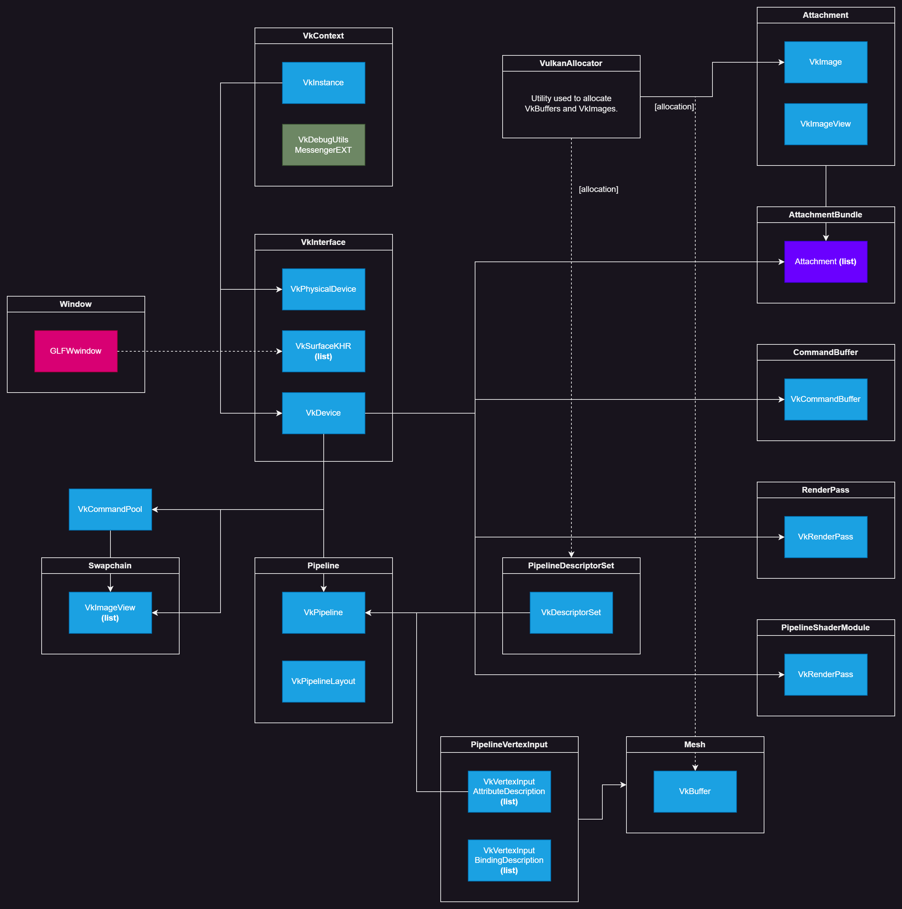

# Rendering (Vulkan bootstrapping)

Ashbloom began as a Vulkan bootstrapping library, before becoming a general framework for game and application development. I made sure not to obscure any Vulkan functionality from this library, and if you ever want to access the `vulkan-zig` binding this library uses to build your own Vulkan engine or utilities, you can via `root.vk`. Ashbloom simply provides some of its own utilities which may prove useful.

This document is not a Vulkan programming guide, and attempting to create one here would betray my own limited understanding of the API. If you're a newcomer to graphics programming, or to Vulkan, I would recommend starting with Khronos' [official Vulkan tutorial](https://docs.vulkan.org/tutorial/latest/00_Introduction.html), which takes you through the process of building a simple engine in Vulkan with C++, though the tutorial could still be followed for other systems languages, like Zig.

If you're familiar with Vulkan, you should be able to proceed with little issue. Here's a diagram showing how the common Vulkan structures are organized in Ashbloom's rendering modules:

This dependency graph shows how Vulkan objects are contained within the structs found in this namespace. Connections indicate dependencies, and it can be largely assumed that if a structure contains something which depends on an object a different structure contains, then the structure overall depends on that other structure. The arrow points towards the object which depends on the structure the arrow is pointing from.

Blue objects are Vulkan objects, with gray ones being optional. Dependencies within structures are not graphed here but do exist (such as `VkDevice` depending on a chosen  `VkPhysicalDevice`). Purple objects are Ashbloom structures, and pink objects are structures found within other libraries/dependencies. Since `VulkanAllocator` is considered a utility (found within `utils`), it's not elaborated on much here. 

This diagram is simplified, and lacks a lot of details within each module, such as all of the shader modules and info structures in the `Pipeline` structure (like `VkPipelineRasterizationStateCreateInfo` for example), or the `CommandBuffer` list and synchronization objects contained in the `Swapchain` structure, or the various info structures needed for a `PipelineDescriptorSet`, etc.

Hopefully, this gives you a good idea on how this namespace is structured overall.

## Modules

1. [vk_core](./pages/rendering/vk_core.md)
2. [window](./pages/rendering/window.md)
3. [swapchain](./pages/rendering/swapchain.md)
4. 